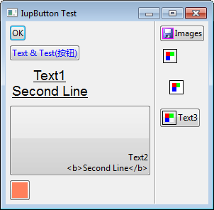

# Iup4D
Iup4D is a D binding library for IUP with OOP style. Its API is similar to WinForms.

Copyright © 2016-2017 BitWorld. All Rights Reserved.

## License
This software is licensed under the Boost Software License, Version 1.0.

For more details, see the full text of the license in the file Boost.txt.

## Requirements
Tools | Version
--- | ---
DMD | 2.075
DUB | 1.4.0
Visual D | 0.45.0
IUP | 3.22
DerelictGL3 | 2.0


## Build status
Platform | Building | Runing
--- | --- | ---
Windows x86 | succeeded | succeeded
Windows x64 | succeeded | crashed
Linux | Todo | Todo


## Example
```D
module main;

import std.stdio;
import core.stdc.stdlib; 

import iup;
import toolkit;

version(Windows) { 
    pragma(lib, "iup.lib");
    pragma(lib, "iupimglib.lib"); // required only if function IupImageLibOpen() is called
    pragma(lib, "iupim.lib");
    pragma(lib, "im.lib");
    pragma(lib, "iupcontrols.lib");
    pragma(lib, "iupgl.lib");
    pragma(lib, "opengl32.lib");
    pragma(lib, "iupglcontrols.lib");

    pragma(lib, "iupcd.lib");
    pragma(lib, "cd.lib");
    pragma(lib, "cdgl.lib");
    pragma(lib, "cdpdf.lib"); 
}

int main(string[] argv)
{
    Application.open();
    Application.useImageLib();

    MainForm mainForm = new MainForm();
    Application.run(mainForm);

	return EXIT_SUCCESS;
}


class MainForm : IupDialog
{
    this()  { super(); }

    protected override void initializeComponent()
    {
        IupLinkLabel linkButton = new IupLinkLabel("http://www.tecgraf.puc-rio.br/iup", "IUP Toolkit");
        linkButton.linkClicked += &linkLabel_linkClicked;

        IupVbox vbox = new IupVbox(linkButton);
        vbox.alignment = HorizontalAlignment.Center;

        this.child = vbox;
        this.margin = Size(10, 10);
        this.title = "Iup Demo";
        this.rasterSize = Size(300, 200);

        this.loaded += &dialog_loaded;
        this.closing += &dialog_closing;
    }

    private void dialog_loaded(Object sender, CallbackEventArgs args)
    {
        // do something after the dialog is loaded
    }

    private void dialog_closing(Object sender, CallbackEventArgs e)
    {
        e.result = IupElementAction.Close;
    }

    private void linkLabel_linkClicked(Object sender, CallbackEventArgs e, string url)
    {
        writefln("url (%s)", url);
    }
}
```


    // dub build :simple-demo --arch=x86_mscoff --build=debug --compiler=dmd


## Screenshots



## Todo
- Bind more APIs for more controls
- Port more test examples
- Check and fix memory leak bugs
- Stable API for wrapper librarys

## Acknowledgement
Name | URL
--- | ---
Tecgraf | http://webserver2.tecgraf.puc-rio.br/iup/
DMD | https://dlang.org/
Visual D | https://github.com/dlang/visuald
mogud/iupd | https://github.com/mogud/iupd
carblue/iup | https://github.com/carblue/iup
DerelictOrg | https://github.com/DerelictOrg
DGui | https://bitbucket.org/dgui/dgui